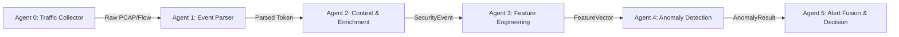

# Multi-Agent SOC Detection System Architecture

> **Document Status**: Initial Architecture Specification (v1.0)

---

## 1. System Overview & Component Boundaries

The Multi-Agent SOC Detection System is a modular pipeline for real-time and batch network intrusion analysis. Each agent has an isolated responsibility domain defined by strict data contracts.



### Component Ownership
- **Agents 0, 1, 2**: Maintained by external team members (Collector, Parser, Context Enricher).
- **Agent 3 (Feature Engineering)**: Primary component (This repository). Transforms incoming `SecurityEvent` instances into scaled, numerical `FeatureVector` payloads.
- **Agent 4 (Anomaly Detection)**: Primary component (This repository). Evaluates `FeatureVector` instances using an independently calibrated Isolation Forest to produce an `AnomalyResult`.
- **Agent 5**: Maintained by external team member (Alert Fusion & Alerting Engine).

---

## 2. Inter-Agent Pipeline Contracts

```text
SecurityEvent (Agent 2 -> Agent 3)
      │
      ▼
Agent 3 Feature Engineer (Vectorization, Preprocessing, Scaling)
      │
      ▼
FeatureVector (Agent 3 -> Agent 4)
      │
      ▼
Agent 4 Anomaly Engine (Isolation Forest, Score Calibration)
      │
      ▼
AnomalyResult (Agent 4 -> Agent 5)
```

1. **`SecurityEvent` Contract (Agent 2 $\rightarrow$ Agent 3)**:
   Contains normalized network event data (protocol, header flags, byte counts, timing statistics, and optional flow identifiers).
2. **`FeatureVector` Contract (Agent 3 $\rightarrow$ Agent 4)**:
   An immutable, fixed-size numerical vector representation guaranteed to contain valid, non-NaN 64-bit float values with associated metadata.
3. **`AnomalyResult` Contract (Agent 4 $\rightarrow$ Agent 5)**:
   Contains the decision outcome (is_anomaly), raw decision score, calibrated confidence score, model version, and execution timestamp.

---

## 3. Data Governance & Research Principles

1. **No Data Leakage**:
   Feature scalers (e.g., `RobustScaler`, `MinMaxScaler`) are fitted **strictly on the training split**. Test and validation datasets are transformed using training parameters.
2. **Group-Aware Splitting**:
   Row-level random train/test splitting is prohibited for structured file sets like CICIoT2023. Partitioning is executed at the file/group level to prevent temporal correlation leakage.
3. **Reproducibility**:
   All random operations (e.g., Isolation Forest initialization, train/test splitting) enforce a fixed, documented `random_state`.
