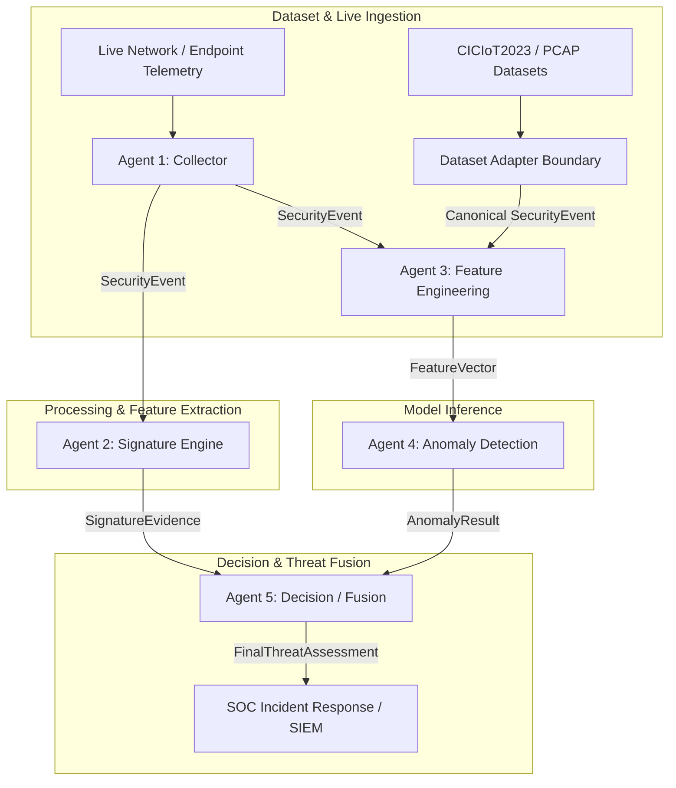

# Multi-Agent SOC Detection System Architecture

> **Document Status**: Canonical Multi-Agent Architecture Contract Specification (v2.1 - Frozen Architecture & Dataset Boundaries)

---

## 1. System Overview & Component Responsibilities

The Multi-Agent SOC Detection System is an enterprise-grade, modular security pipeline designed for heterogeneous telemetry ingestion, signature rule matching, feature transformation, machine learning anomaly detection, and alert decision fusion.

To maintain strict separation of concerns, eliminate data leakage, and ensure auditability, each agent in the system operates within an isolated domain governed by explicit data contracts.

---

## 2. Architectural Evaluation: SecurityEvent ↔ CICIoT2023 Compatibility

CICIoT2023 provides 39 columns of flow-statistical telemetry (e.g., `Rate`, `Srate`, `Drate`, `IAT`, `Tot size`, `Tot sum`, `Min`, `Max`, `AVG`, `Std`, `Variance`, protocol indicators, TCP/UDP/ICMP flags).

The system evaluated two architectural options for ingested event representation:

### Option Evaluation Matrix

| Criterion | Option A: Extend `SecurityEvent` with Typed Flow Statistics | Option B: Convert CICIoT2023 via Dataset Adapter to Minimal `SecurityEvent` | Recommended Selection |
| :--- | :--- | :--- | :--- |
| **Agent Ownership** | Maintains Agent 3 ownership of feature scaling while Agent 1 / Adapter owns schema parsing. | Forces Agent 3 or Adapter to strip flow metrics or abuse `custom_attributes`. | **Option A** |
| **Runtime & Live Compatibility** | Native support for NetFlow, IPFIX, Zeek flow summaries, and live flow taps. | Requires separate payload contracts for packet-level vs flow-level telemetry. | **Option A** |
| **CICIoT2023 Compatibility** | Represents all 39 flow columns natively without data loss. | Omits key flow statistics or relies on undocumented dictionary hacks. | **Option A** |
| **Research Reproducibility** | Full fidelity mapping of benchmark datasets into canonical pipeline. | Partial feature loss or inconsistent schema transformation across dataset runs. | **Option A** |
| **Future Dataset Support** | Extensible to CIC-IDS2017, UNSW-NB15, and BoT-IoT flow statistics. | Rigid schema breaks on datasets lacking raw L3/L4 packet headers. | **Option A** |
| **Prevention of Leakage** | Explicitly types numeric metrics while isolating ground-truth metadata. | High risk of storing attack labels or file paths in unstructured attributes. | **Option A** |

### Architectural Decision
The system adopts **Option A (Typed Flow Statistics in `SecurityEvent`) paired with a Dataset Adapter Boundary**:
- `SecurityEvent` is extended with explicit, typed flow-statistic fields (`flow_rate`, `mean_iat_ms`, `std_iat_ms`, `min_packet_size`, `max_packet_size`, `avg_packet_size`, `std_packet_size`, `variance_packet_size`, `tot_size`, `tot_sum`, `packet_count`, `protocol_type_code`, TCP flag counts).
- Offline datasets (e.g., CICIoT2023) are ingested via a dedicated **Dataset Adapter** that maps CSV rows directly into canonical `SecurityEvent` payloads.
- **Undocumented Workaround Prohibition**: `custom_attributes` MUST NOT be used as a dumping ground for flow statistics or ground-truth labels.

---

## 3. Canonical Agent Input & Output Contracts

| Agent | Module Name | Input Payload | Output Payload | Primary Ownership |
| :--- | :--- | :--- | :--- | :--- |
| **Agent 1** | Collector / Ingest Parser | Raw Endpoint & Network Telemetry | `SecurityEvent` | Ingestion, normalization, schema validation, metadata provenance tagging. |
| **Dataset Adapter** | Dataset Ingestion Boundary | Offline Dataset Files (CICIoT2023 CSVs) | `SecurityEvent` | Mapping offline dataset rows to canonical `SecurityEvent` instances. |
| **Agent 2** | Signature Engine | `SecurityEvent` | `SignatureEvidence` | Rule-based signature evaluation, static indicator matching, rule severity scoring. |
| **Agent 3** | Feature Engineering | `SecurityEvent` | `FeatureVector` | Feature transformation, categorical encoding, scaling, non-NaN numerical vectorization. |
| **Agent 4** | Anomaly Detection | `FeatureVector` | `AnomalyResult` | Unsupervised/supervised ML model inference (Isolation Forest), decision scoring, confidence calibration. |
| **Agent 5** | Decision / Fusion Engine | `SignatureEvidence` + `AnomalyResult` | `FinalThreatAssessment` | Multi-source evidence fusion, threat level assignment, automated action recommendation. |

---

## 4. Critical Architectural Rules & Invariants

1. **Feature Engineering Isolation**:
   - **Agent 1 MUST NOT create the final ML `FeatureVector`**.
   - Agent 1 and Dataset Adapters MUST NOT create the final ML `FeatureVector`. Agent 3 exclusively owns feature engineering, scaling, normalization, and missing-value imputation.
2. **Anomaly Detection Isolation**:
   - **Agent 2 MUST NOT perform anomaly detection or score evaluation**.
   - Agent 4 exclusively owns machine learning model inference, score calibration, and anomaly status determination.
3. **Strict Metadata Non-Leakage Rule**:
   - Metadata fields (`dataset_name`, `category`, `attack_label`, `source_file`, `folder_name`, `provenance`, `collector_version`, `test_metadata`, `simulator_scenario`, evaluation timestamps) **MUST NOT automatically become ML numerical features**.
   - `custom_attributes` is strictly audited and MUST NOT contain target labels or provenance metadata.
4. **Synthetic Timestamp Policy**:
   - Offline datasets lacking absolute wall-clock timestamps (such as CICIoT2023) assign synthetic timestamps tagged with `is_synthetic_timestamp = True`.
   - Agent 3/4/5 **MUST NOT** derive ML temporal features (e.g., hour-of-day, day-of-week) from synthetic timestamps.
5. **Protocol Type Mapping Status**:
   - CICIoT2023 numeric `Protocol Type` (e.g. 6, 17, 1, 0) is ingested into `protocol_type_code` as an integer IANA protocol identifier.
   - Text string mapping for `Protocol Type` is marked **`NOT ESTABLISHED`** due to lack of authoritative text enum tables in dataset artifacts. Agent 3 uses numeric codes directly.

---

## 5. Supported Telemetry Provenance Types

All `SecurityEvent` payloads emitted by Agent 1 or Dataset Adapters MUST designate one of the following canonical provenance source types:

- **`LIVE_ENDPOINT`**: Streaming host telemetry (process creation, file modification, registry modification, user authentication).
- **`LIVE_NETWORK`**: Real-time network interface flow capture or tap (NetFlow, IPFIX, Zeek logs).
- **`PCAP`**: Offline packet capture file replay.
- **`CICIoT2023`**: Static benchmark dataset flow records derived from the CICIoT2023 research corpus.
- **`SIMULATOR`**: Synthetic event sequence generated by controlled adversary simulation tools (e.g., Caldera, Atomic Red Team).
- **`TEST`**: Mock payloads generated strictly within test suites and CI pipelines.

---

## 6. Explicit Domain Non-Ownership Matrix

| Agent | Explicitly DOES NOT Own |
| :--- | :--- |
| **Agent 1 (Collector)** | • MUST NOT generate ML `FeatureVector` payloads. • MUST NOT perform feature scaling or vector normalization. • MUST NOT evaluate signature rules or ML anomaly models. |
| **Agent 2 (Signature Engine)** | • MUST NOT perform ML model inference or anomaly score calibration. • MUST NOT alter `SecurityEvent` structure or perform feature scaling. • MUST NOT make final SOC alert disposition decisions (delegated to Agent 5). |
| **Agent 3 (Feature Engineering)** | • MUST NOT ingest raw network PCAPs or raw endpoint OS events directly. • MUST NOT perform signature rule evaluation or CVE lookups. • MUST NOT evaluate ML decision thresholds or assign anomaly scores. |
| **Agent 4 (Anomaly Detection)** | • MUST NOT parse raw telemetry or extract primitive fields from `SecurityEvent`. • MUST NOT run YARA, Snort, or Sigma signature rules. • MUST NOT output raw uncalibrated scores directly to SOC dashboards without confidence mapping. |
| **Agent 5 (Decision/Fusion)** | • MUST NOT ingest raw telemetry or manage data collectors. • MUST NOT fit ML scalers or train anomaly detection models. • MUST NOT re-evaluate individual signature rules or recalculate feature values. |

---

## 7. Repository Data Contracts

Detailed field-level specifications, type constraints, and validation requirements are frozen in the contract documents below:

1. [SecurityEvent Contract Specification](file:///d:/b%20tech/feature_eng+/docs/contracts/security_event.md) (`Agent 1` / `Adapter` $\rightarrow$ `Agent 2`, `Agent 3`)
2. [SignatureEvidence Contract Specification](file:///d:/b%20tech/feature_eng+/docs/contracts/signature_evidence.md) (`Agent 2` $\rightarrow$ `Agent 5`)
3. [FeatureVector Contract Specification](file:///d:/b%20tech/feature_eng+/docs/contracts/feature_vector.md) (`Agent 3` $\rightarrow$ `Agent 4`)
4. [AnomalyResult Contract Specification](file:///d:/b%20tech/feature_eng+/docs/contracts/anomaly_result.md) (`Agent 4` $\rightarrow$ `Agent 5`)
5. [FinalThreatAssessment Contract Specification](file:///d:/b%20tech/feature_eng+/docs/contracts/final_threat_assessment.md) (`Agent 5` $\rightarrow$ `SOC / SIEM`)
