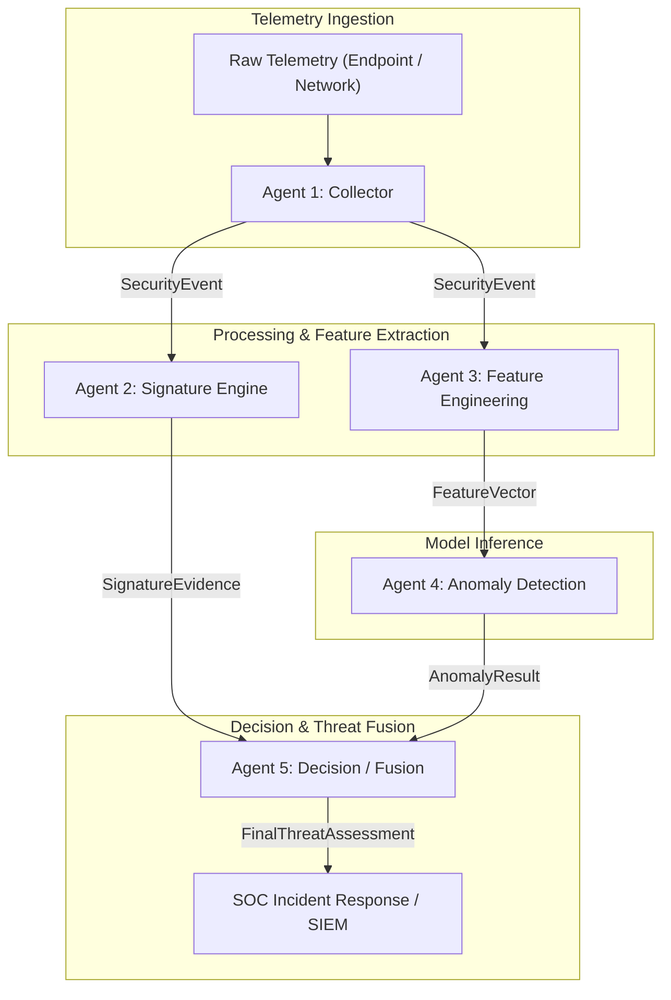

# Multi-Agent SOC Detection System Architecture

> **Document Status**: Canonical Multi-Agent Architecture Contract Specification (v2.0 - Frozen)

---

## 1. System Overview & Component Responsibilities

The Multi-Agent SOC Detection System is an enterprise-grade, modular security pipeline designed for heterogeneous telemetry ingestion, signature rule matching, feature transformation, machine learning anomaly detection, and alert decision fusion.

To maintain strict separation of concerns, eliminate data leakage, and ensure auditability, each agent in the system operates within an isolated domain governed by explicit data contracts.

---

## 2. Canonical Agent Input & Output Contracts

| Agent | Module Name | Input Payload | Output Payload | Primary Ownership |
| :--- | :--- | :--- | :--- | :--- |
| **Agent 1** | Collector / Ingest Parser | Raw Endpoint & Network Telemetry | `SecurityEvent` | Ingestion, normalization, schema validation, metadata provenance tagging. |
| **Agent 2** | Signature Engine | `SecurityEvent` | `SignatureEvidence` | Rule-based signature evaluation, static indicator matching, rule severity scoring. |
| **Agent 3** | Feature Engineering | `SecurityEvent` | `FeatureVector` | Feature transformation, categorical encoding, scaling, non-NaN numerical vectorization. |
| **Agent 4** | Anomaly Detection | `FeatureVector` | `AnomalyResult` | Unsupervised/supervised ML model inference (Isolation Forest), decision scoring, confidence calibration. |
| **Agent 5** | Decision / Fusion Engine | `SignatureEvidence` + `AnomalyResult` | `FinalThreatAssessment` | Multi-source evidence fusion, threat level assignment, automated action recommendation. |

---

## 3. Critical Architectural Rules & Invariants

1. **Feature Engineering Isolation**:
   - **Agent 1 MUST NOT create the final ML `FeatureVector`**.
   - Agent 3 exclusively owns feature engineering, scaling, normalization, and missing-value imputation.
2. **Anomaly Detection Isolation**:
   - **Agent 2 MUST NOT perform anomaly detection or score evaluation**.
   - Agent 4 exclusively owns machine learning model inference, score calibration, and anomaly status determination.
3. **Strict Provenance Separation**:
   - Provenance/source metadata fields (`source_type`, `sensor_id`, `collector_version`, `raw_payload_b64`) **MUST NOT automatically become ML features**.
   - Provenance tags are reserved for filtering, grouping, auditing, and downstream routing.
4. **No Implementation Sprawl**:
   - Agent modules 1 through 5 must remain decoupled. No agent may bypass inter-agent contract schemas to read or write internal state of another agent.

---

## 4. Supported Telemetry Provenance Types

All `SecurityEvent` payloads emitted by Agent 1 MUST designate one of the following canonical provenance source types:

- **`LIVE_ENDPOINT`**: Streaming host telemetry (process creation, file modification, registry modification, user authentication).
- **`LIVE_NETWORK`**: Real-time network interface flow capture or tap (NetFlow, IPFIX, Zeek logs).
- **`PCAP`**: Offline packet capture file replay.
- **`CICIoT2023`**: Static benchmark dataset flow records derived from the CICIoT2023 research corpus.
- **`SIMULATOR`**: Synthetic event sequence generated by controlled adversary simulation tools (e.g., Caldera, Atomic Red Team).
- **`TEST`**: Mock payloads generated strictly within test suites and CI pipelines.

---

## 5. Explicit Domain Non-Ownership Matrix

| Agent | Explicitly DOES NOT Own |
| :--- | :--- |
| **Agent 1 (Collector)** | • MUST NOT generate ML `FeatureVector` payloads. • MUST NOT perform feature scaling or vector normalization. • MUST NOT evaluate signature rules or ML anomaly models. |
| **Agent 2 (Signature Engine)** | • MUST NOT perform ML model inference or anomaly score calibration. • MUST NOT alter `SecurityEvent` structure or perform feature scaling. • MUST NOT make final SOC alert disposition decisions (delegated to Agent 5). |
| **Agent 3 (Feature Engineering)** | • MUST NOT ingest raw network PCAPs or raw endpoint OS events directly. • MUST NOT perform signature rule evaluation or CVE lookups. • MUST NOT evaluate ML decision thresholds or assign anomaly scores. |
| **Agent 4 (Anomaly Detection)** | • MUST NOT parse raw telemetry or extract primitive fields from `SecurityEvent`. • MUST NOT run YARA, Snort, or Sigma signature rules. • MUST NOT output raw uncalibrated scores directly to SOC dashboards without confidence mapping. |
| **Agent 5 (Decision/Fusion)** | • MUST NOT ingest raw telemetry or manage data collectors. • MUST NOT fit ML scalers or train anomaly detection models. • MUST NOT re-evaluate individual signature rules or recalculate feature values. |

---

## 6. Repository Data Contracts

Detailed field-level specifications, type constraints, and validation requirements are frozen in the contract documents below:

1. [SecurityEvent Contract Specification](file:///d:/b%20tech/feature_eng+/docs/contracts/security_event.md) (`Agent 1` $\rightarrow$ `Agent 2`, `Agent 3`)
2. [SignatureEvidence Contract Specification](file:///d:/b%20tech/feature_eng+/docs/contracts/signature_evidence.md) (`Agent 2` $\rightarrow$ `Agent 5`)
3. [FeatureVector Contract Specification](file:///d:/b%20tech/feature_eng+/docs/contracts/feature_vector.md) (`Agent 3` $\rightarrow$ `Agent 4`)
4. [AnomalyResult Contract Specification](file:///d:/b%20tech/feature_eng+/docs/contracts/anomaly_result.md) (`Agent 4` $\rightarrow$ `Agent 5`)
5. [FinalThreatAssessment Contract Specification](file:///d:/b%20tech/feature_eng+/docs/contracts/final_threat_assessment.md) (`Agent 5` $\rightarrow$ `SOC / SIEM`)
