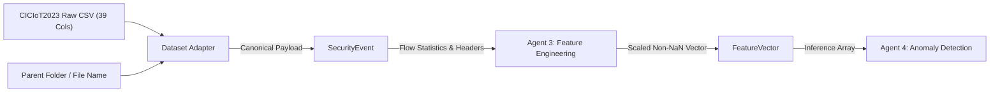

# CICIoT2023 Dataset Feature Mapping Specification

> **Document Status**: Canonical Dataset-to-Contract Feature Mapping (v1.0 - Frozen)

---

## 1. Dataset Adapter Dataflow Architecture

The Dataset Adapter acts as an isolation boundary between raw offline benchmark CSV files and the multi-agent detection pipeline. It ingests 39-column CSV records, attaches dataset-level provenance, and outputs canonical `SecurityEvent` payloads without permitting ground-truth metadata or file attributes to leak into Agent 3 feature vectors.

---

## 2. Complete 39-Column Feature Mapping Matrix

Every column in the 39-column CICIoT2023 schema is explicitly accounted for. No column is silently ignored or discarded without classification.

| Index | CICIoT2023 Raw Column | Classification | Target Field in `SecurityEvent` | Transformation / Handling Logic | Downstream Consumer |
| :---: | :--- | :--- | :--- | :--- | :--- |
| `[00]` | `Header_Length` | **1. Used Directly** | `header_length` | Extracted directly as float value in bytes. | Agent 3 |
| `[01]` | `Protocol Type` | **1. Used Directly** | `protocol_type_code` | Extracted directly as integer IANA protocol identifier. Text string mapping marked `NOT ESTABLISHED`. | Agent 3 |
| `[02]` | `Time_To_Live` | **1. Used Directly** | `time_to_live` | Extracted directly as IP TTL float value. | Agent 3 |
| `[03]` | `Rate` | **1. Used Directly** | `flow_rate` | Extracted directly as flow transmission rate (packets/sec). | Agent 3 |
| `[04]` | `fin_flag_number` | **2. Transformed** | `tcp_fin_count` | Converted float indicator into integer/float count metric. | Agent 2, Agent 3 |
| `[05]` | `syn_flag_number` | **2. Transformed** | `tcp_syn_count` | Converted float indicator into integer/float count metric. | Agent 2, Agent 3 |
| `[06]` | `rst_flag_number` | **2. Transformed** | `tcp_rst_count` | Converted float indicator into integer/float count metric. | Agent 2, Agent 3 |
| `[07]` | `psh_flag_number` | **2. Transformed** | `tcp_psh_count` | Converted float indicator into integer/float count metric. | Agent 2, Agent 3 |
| `[08]` | `ack_flag_number` | **2. Transformed** | `tcp_ack_count` | Converted float indicator into integer/float count metric. | Agent 2, Agent 3 |
| `[09]` | `ece_flag_number` | **2. Transformed** | `tcp_ece_count` | Converted float indicator into integer/float count metric. | Agent 2, Agent 3 |
| `[10]` | `cwr_flag_number` | **2. Transformed** | `tcp_cwr_count` | Converted float indicator into integer/float count metric. | Agent 2, Agent 3 |
| `[11]` | `ack_count` | **1. Used Directly** | `tcp_ack_count` | Extracted directly as TCP ACK packet count. | Agent 2, Agent 3 |
| `[12]` | `syn_count` | **1. Used Directly** | `tcp_syn_count` | Extracted directly as TCP SYN packet count. | Agent 2, Agent 3 |
| `[13]` | `fin_count` | **1. Used Directly** | `tcp_fin_count` | Extracted directly as TCP FIN packet count. | Agent 2, Agent 3 |
| `[14]` | `rst_count` | **1. Used Directly** | `tcp_rst_count` | Extracted directly as TCP RST packet count. | Agent 2, Agent 3 |
| `[15]` | `HTTP` | **1. Used Directly** | `proto_http_flag` | Binary protocol indicator (1.0 or 0.0). | Agent 2, Agent 3 |
| `[16]` | `HTTPS` | **1. Used Directly** | `proto_https_flag` | Binary protocol indicator (1.0 or 0.0). | Agent 2, Agent 3 |
| `[17]` | `DNS` | **1. Used Directly** | `proto_dns_flag` | Binary protocol indicator (1.0 or 0.0). | Agent 2, Agent 3 |
| `[18]` | `Telnet` | **1. Used Directly** | `proto_telnet_flag` | Binary protocol indicator (1.0 or 0.0). | Agent 2, Agent 3 |
| `[19]` | `SMTP` | **1. Used Directly** | `proto_smtp_flag` | Binary protocol indicator (1.0 or 0.0). | Agent 2, Agent 3 |
| `[20]` | `SSH` | **1. Used Directly** | `proto_ssh_flag` | Binary protocol indicator (1.0 or 0.0). | Agent 2, Agent 3 |
| `[21]` | `IRC` | **1. Used Directly** | `proto_irc_flag` | Binary protocol indicator (1.0 or 0.0). | Agent 2, Agent 3 |
| `[22]` | `TCP` | **1. Used Directly** | `proto_tcp_flag` | Binary transport protocol indicator (1.0 or 0.0). | Agent 2, Agent 3 |
| `[23]` | `UDP` | **1. Used Directly** | `proto_udp_flag` | Binary transport protocol indicator (1.0 or 0.0). | Agent 2, Agent 3 |
| `[24]` | `DHCP` | **1. Used Directly** | `proto_dhcp_flag` | Binary protocol indicator (1.0 or 0.0). | Agent 2, Agent 3 |
| `[25]` | `ARP` | **1. Used Directly** | `proto_arp_flag` | Binary protocol indicator (1.0 or 0.0). | Agent 2, Agent 3 |
| `[26]` | `ICMP` | **1. Used Directly** | `proto_icmp_flag` | Binary protocol indicator (1.0 or 0.0). | Agent 2, Agent 3 |
| `[27]` | `IGMP` | **1. Used Directly** | `proto_igmp_flag` | Binary protocol indicator (1.0 or 0.0). | Agent 2, Agent 3 |
| `[28]` | `IPv` | **1. Used Directly** | `proto_ipv_flag` | Binary IP version indicator. | Agent 2, Agent 3 |
| `[29]` | `LLC` | **1. Used Directly** | `proto_llc_flag` | Binary Link Layer Control indicator. | Agent 2, Agent 3 |
| `[30]` | `Tot sum` | **1. Used Directly** | `tot_sum` | Flow byte total sum metric. | Agent 3 |
| `[31]` | `Min` | **1. Used Directly** | `min_packet_size` | Minimum packet size in flow bytes. | Agent 3 |
| `[32]` | `Max` | **1. Used Directly** | `max_packet_size` | Maximum packet size in flow bytes. | Agent 3 |
| `[33]` | `AVG` | **1. Used Directly** | `avg_packet_size` | Average packet size in flow bytes. | Agent 3 |
| `[34]` | `Std` | **1. Used Directly** | `std_packet_size` | Standard deviation of packet sizes. | Agent 3 |
| `[35]` | `Tot size` | **1. Used Directly** | `tot_size` | Flow total size metric. | Agent 3 |
| `[36]` | `IAT` | **1. Used Directly** | `mean_iat_ms` | Mean inter-arrival time in milliseconds. | Agent 3 |
| `[37]` | `Number` | **1. Used Directly** | `packet_count` | Total packet count in flow. | Agent 3 |
| `[38]` | `Variance` | **1. Used Directly** | `variance_packet_size` | Variance of packet sizes in flow. | Agent 3 |

---

## 3. Structural & Ground-Truth Metadata Classification

In addition to the 39 CSV header columns, the dataset loader extracts file-level and directory-level metadata. These fields are classified strictly as **Ground-truth metadata** or **Provenance metadata**:

| External Item | Category | Field Name | Handling & Isolation Invariants | Downstream Consumer |
| :--- | :--- | :--- | :--- | :--- |
| Parent Folder Name (e.g. `DDoS-ICMP_Flood`) | **4. Ground-truth metadata** | `attack_label` / `category` | Stored exclusively in loader evaluation registry. **MUST NOT** be attached to `SecurityEvent` or enter Agent 3 `FeatureVector`. | Evaluation Harness / Model Test Suite |
| Source File Name (e.g. `part-00000.csv`) | **5. Provenance metadata** | `source_file` | Stored in `sensor_id` or provenance header for line-level auditing. **MUST NOT** become ML features. | Pipeline Audit / Lineage Tracking |
| Ingest Synthetic Timestamp | **5. Provenance metadata** | `is_synthetic_timestamp` | Set to `True` for all CICIoT2023 rows. Agent 3 masks ML temporal features. | Agent 3 (Temporal Masking) |

---

## 4. Verification & Audit Summary

- **Total CSV Columns Mapped**: `39 / 39 (100%)`
- **Unmapped or Silently Dropped Columns**: `0`
- **Metadata Leakage Protection**: Ground-truth labels (`category`, `attack_label`) and file paths (`source_file`) are strictly isolated from the numerical feature space.
